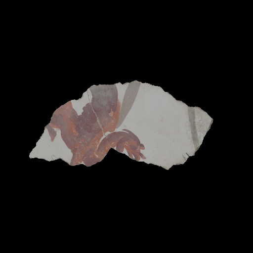
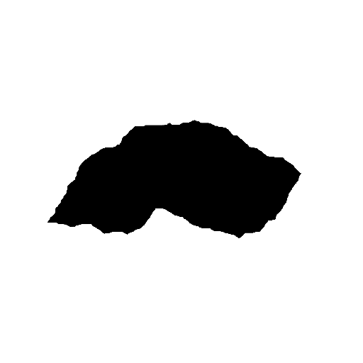
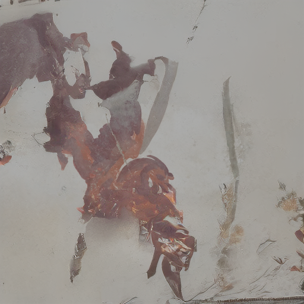
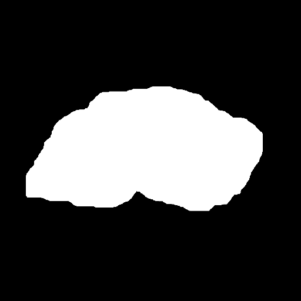
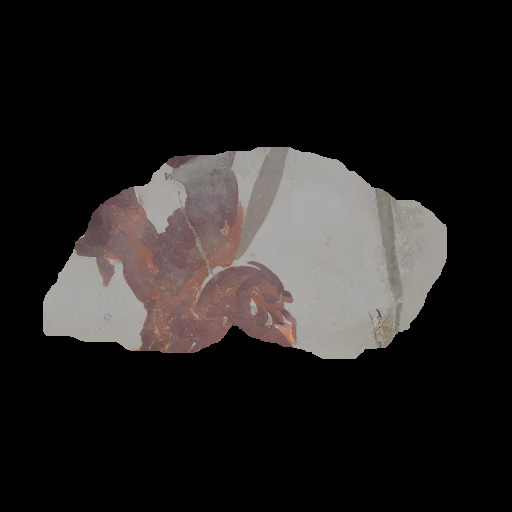
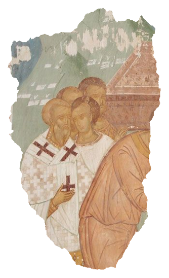
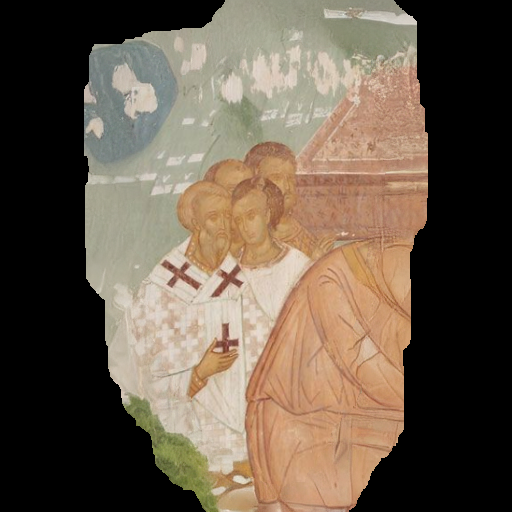
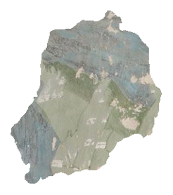
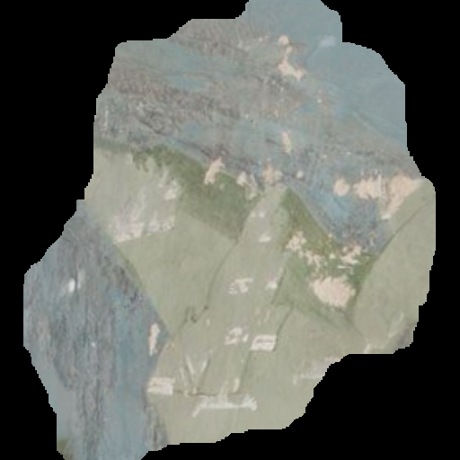

# Outpainting with diffusion models 

A possibility is to use diffusion models for outpainting, as they seem to be very good at generating plausible content. 

## 1) Using pre-trained models
The first quick way to do this is to use a pre-trained model, in our experiments the [ldm](https://github.com/CompVis/latent-diffusion#inpainting) from [Rombach et al.](https://arxiv.org/abs/2112.10752). 

Instructions on how to download weights and inpaint are in their repository, [here](https://github.com/CompVis/latent-diffusion#inpainting). They actually use it for inpainting, which makes it slightly different to what we want to do. 

Ideally we would create a different task, but for a quick test we can *trick* the model to outpaint for us. We create an inverted mask that covers the black area around the fragment and dilate it slightly, as seen in the image below. By letting the model *inpaint* all the rest of the image (everything but the fragment) we get a complete squared image (the model accepts squared `512x512` pixels images).
This is usually good around the borders and degradates gradually.

| Image | Inverted Mask | Inpainted | 
|:----:|:-----:|:-----:|
||||

Now we can crop the part around the border (by how much we want or need) and we get the final result (similar to the other extrapolation methods)

| Inpainted Image | Borders Mask | Final Result | 
|:----:|:-----:|:-----:|
||||

The final result is *hard* to evaluate, it probably works very good for natural images, yet probably not perfect for poorly texture regions.

| Image | Final Result | 
|:----:|:-----:|
|||
||| 
||| 

#### Cropping
The code for creating and cropping the masks is in the `cropping` folder, but it is not cleaned or polished. It is nothing sophisticated anyway, so it should be usable with some small refinements if needed.